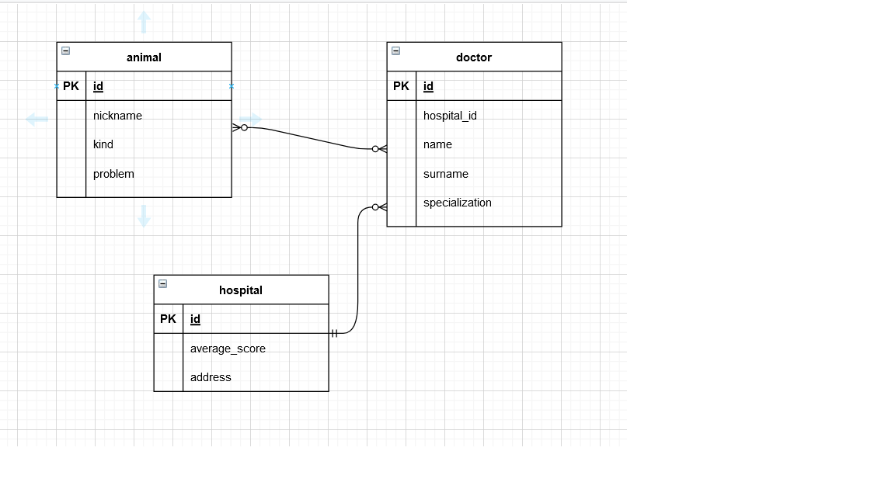
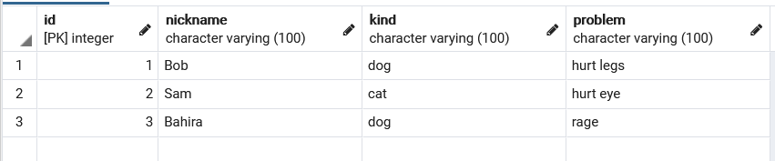
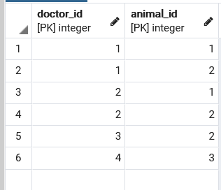
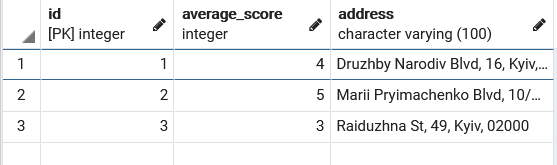
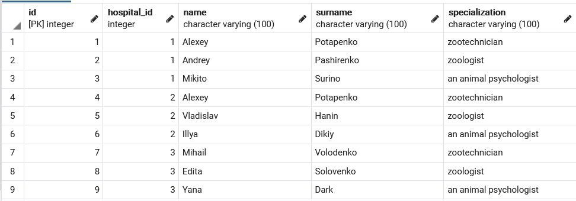

## Предметна галузь

Ветеринарна клініка

## ER-діаграма

## Таблиці

### animal

### doctor_has_animal

### hospital

### doctor

## Опис структури бази даних

| Таблиця | Атрибути | Типи даних |
|------------|---------|--------------------|
| _Таблиця "**animal**"_   Вміщує інформацію про тварин, що лікуються або лікувались в клініці | _id_ — ідентифікатор тварини  _nickname_ — ім'я тварини   _kind_ — тип тварини   _problem_ — хвороба | Числовий   Текстовий   Текстовий   Текстовий
| _Таблиця "**hospital**"_   Вміщує інформацію про клініки| _id_ — ідентифікатор клініки   _avarage_score_ — середня оцінка  _address_ — адреса | Числовий   Числовий   Текстовий |
| _Таблиця "**doctor**"_   Вміщує інформацію про докторів, що працюють в клініках | _id_ — ідентифікатор доктора  _hospital_id_ — номер клініки, в якій працює доктор   _name_ — ім'я   _surname_ — прізвище   _specialization_ — спеціалізація | Числовий   Числовий   Текстовий   Текстовий   Текстовий
| _Таблиця "**doctor_has_animal**"_   Вміщує інформацію про те, які тварини лікуються у яких докторів | _doctor_id_ — ідентифікатор доктора   _animal_id_ — ідентифікатор тварини | Числовий   Числовий
